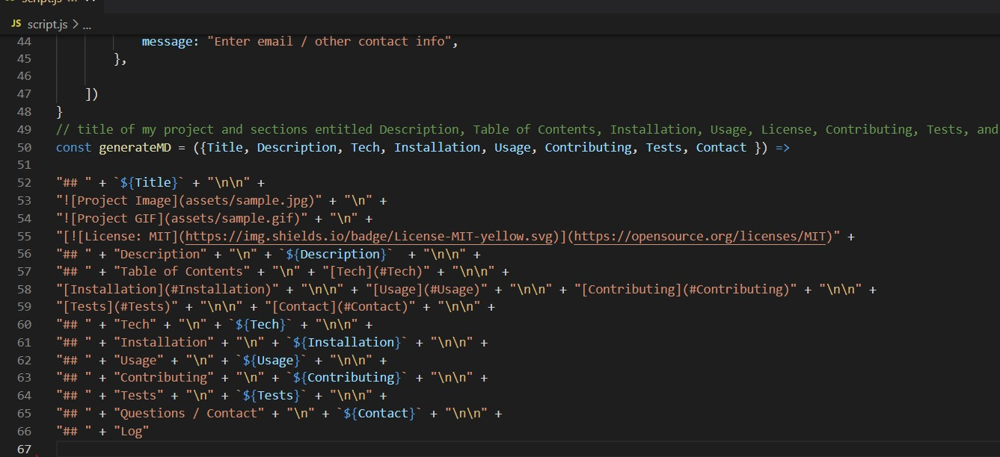

## README Generator

## Description
Node.js-based generator for README.md files

## Table of Contents
[Tech](#Tech)

[Installation](#Installation)

[Usage](#Usage)

[Contributing](#Contributing)

[Tests](#Tests)

[Contact](#Contact)

## Tech
Javascript

## Installation
Runs on node.js, via Visual Studio or equivalent platform. 

## Usage
Open integrated Terminal and run command 'node script'. Respond to following prompts. 
At end of prompting, file is created in Assets folder. 

## Contributing
Miguel Afable

## Tests
None

## Questions / Contact
grimdango@gmail.com

## Log
